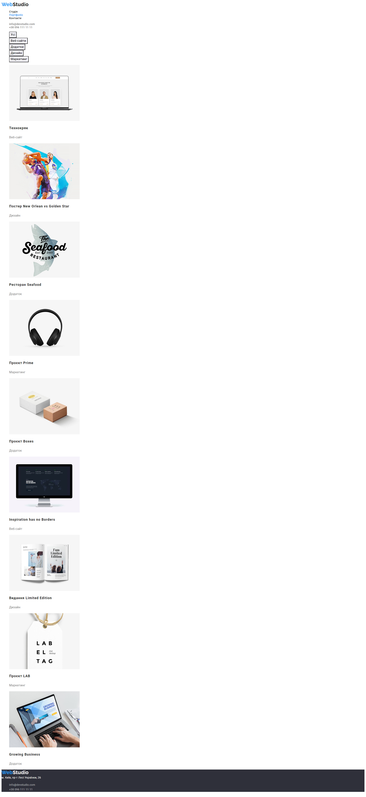

# WebStudio website

## Homework#02

The markup and design of the page
[Layout markup](<https://www.figma.com/file/1ehrLBauvVFu4mVhxsHzyZ/Web-Studio-(Version-2.1)?node-id=1%3A95&mode=dev>)
have been completed. The [squoosh](https://squoosh.app/) service was used to optimize images.
Configured GitHub Pages and added a [link](https://valerii2022.github.io/goit-markup-hw-02-FSON/) to
the live page in the GitHub-repository header.

### [Main Page](https://valerii2022.github.io/goit-markup-hw-02-FSON/)

### [Portfolio Page](https://valerii2022.github.io/goit-markup-hw-02-FSON/portfolio.html)

