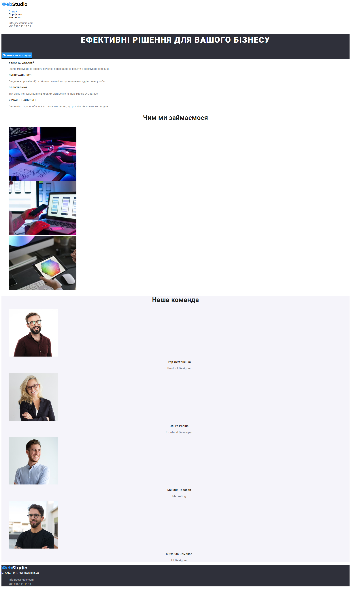

# WebStudio website

## Homework#01

Completed HTML page
[Layout markup](<https://www.figma.com/file/1ehrLBauvVFu4mVhxsHzyZ/Web-Studio-(Version-2.1)?node-id=0%3A1&mode=dev>),
without CSS design. Configured GitHub Pages and added a
[link](https://valerii2022.github.io/goit-markup-hw-01-FSON/) to the live page in the
GitHub-repository header.

